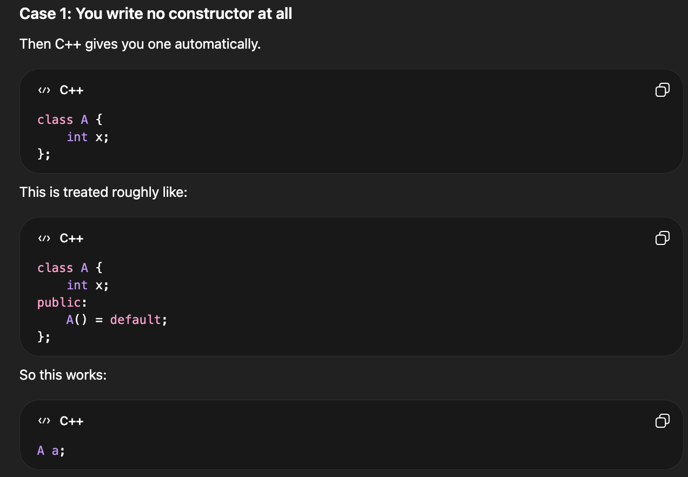

# CPP OOPS (Personal Notes)

1) Object: Real world entities
2) Class: collection of objects / blueprint of entities.
Contains Constructors, Destructor, access specifiers/modifiers, data members/attributes/fields/propeties, member functions/methods, getters, setters

Constructors

    a) Default: A default constructor is one that either: 
        (i) Takes no parameters or 
        (ii) has all parameters with default values.
        > A default constructor is any constructor that can be called without passing arguments.
        If you don't define any constructor, C++ automatically provides a default constructor that does nothing (but still constructs the object). However, if you define any other constructor, the compiler does not generate a default constructor automatically unless you explicitly define it.
        > Below, if you define a define a single parameterized constructor, then you should also define 
        A()=default; for invoking A a; - or else this won't work!



```cpp
class A {
    int x;
public:
    A() = default;              // Default constructor
    A(int val=0){ }             // Still Default constructor
    A(int val) { x = val; }     // Parameterized constructor
};
```

    b) Non-parameterized
    c) Parameterized
    d) Copy Constructor
        i) Shallow copy: copies properties of one object to another
        ii) Deep copy: not only copies data member values but also makes copies of dynamically allocated memory that the members points to
        iii) Copy assignment operator: copy constructor can be called only once, where as copy assignment operator can be called mutiple times, can be overloaded with operator loading of "equals". The copy constructor is called when a new object is initialized from another object, while the copy assignment operator is called when an already existing object is assigned from another object. Since an object is constructed only once but can be assigned many times, copy assignment can be invoked multiple times for the same object. The copy assignment operator is written by overloading operator=.
3) Destructors
4) this keyword: special pointer in cpp that points to the current object = this->x is same as *(this).x
5) Initialization List and const:

    a) Initialization List: shorter format to declare values, const values can also be declared in this

    b) const variable/data member: initialized once, value doesn't change but we can read tho

    c) const parameters: whose values aren't changed inside the function

    d) const functions: functions that don't change the data members values of the class
6) Access modidfiers/specifiers
7) OOPS Concepts

    a) Encapsulation: wrapping up of data members and methods in a single unit called class
    [implemented using Access specifiers, classes, getters/setters]
    Data Hiding: **Only** hide unnecessary/sensitive details

    b) Abstraction: Hiding unnecessary/sensitive implementation details and showing only the required/important parts!
    [implemented using Abstract interface, functions, abstract classes]

    Encapsulation is the process of wrapping data and methods into a single unit called class and restricting direct access to the data using mechanisms like private members and getters/setters.
    Abstraction is the process of hiding internal implementation details and showing only the essential functionality to the user.

    In simple terms:
    Encapsulation = hide data | Abstraction = hide complexity

    Example: Below, in the Car class, making speed private and accessing it through getters/setters is encapsulation, while providing a start() function without exposing the engine logic is abstraction.

```cpp
class Car {
private:
    int speed; // encapsulation: hidden data

public:
    Car() : speed(0) {}

    void setSpeed(int s) { // encapsulation through setter
        if (s >= 0)
            speed = s;
    }

    int getSpeed() const { // encapsulation through getter
        return speed;
    }

    void start() { // abstraction: user just starts the car
        cout << "Car started\n";
    }
};
```

    c) Inheritance: data members and methods of a base class is passed on to the derived class   
    - Mode of Inheritance: base class can be inherited as private, protected and public (mode)
    - Types of Inheritance: Single Level, Multi-level, Multiple, Hierarchial, and Hybrid

    d) Polymorphism: ability of objects to take different forms or behaving in a different way based on the context in which they are used
        
        i) Compile Time Polymorphism: Function signature (return statement and parameters) is different
            = Constructor Overloading
            = Function Overloading
            = Operator Overloading
        
        ii) Runtime Polymorphism
            = Function Overriding: Function signature (return statement and parameters) is same, the implementation is different. The parent class is said to be overriden!
            = Virtual Functions: member function that is **expected** to be redefined/overriden in the derived class
                    -- Can have implementation
                    -- Maybe overridden
                    -- Instantiable base class
                    -- virtual void func();
            = Pure Virtual Functions: member function that **must** be redefined/overriden in the derived class
                    -- No implementation
                    -- Must be overridden
                    -- Non instantiable base class
                    -- virtual void func() = 0;
    
8) Abstract Class: used to provide a base class from which other classes can be derived, cannot be instantiated and are meant to be inherited, are typically used to define interfaces of derived class. A class becomes abstract if it contains at least one pure virtual function. Can have non-virtual methods too.
9) Static keyword

    a) Static Variables:
        
        i) Inside Function: Variables declared as static in a function are created & initialised once for the lifetime of the program.
       
        ii) Inside Class: Static variables in a class are created & initialised once. They are shared by all the objects of the class.
   
    b) Static Objects: A static object is an object declared with the static keyword, which means: It is created only once. It retains its value/state between function calls. It is destroyed only when the program ends (not when the function/block ends). Stored in static/global memory area. Save state across function calls.

10) Friend class and Friend Function: In C++, private and protected members of a class cannot normally be accessed from outside the class. But sometimes, you might want a specific external function or another class to access those private/protected members without making everything public. To do that, you use the keyword friend.

- Friend Function: A friend function is not a member of the class but has access to its private and protected data.
- Friend Class: If one class needs to access private/protected members of another class, make it a friend class.

## Notes

### OOPS

[0] Notes


[1] Runtime Polymorphism Guide


[2] When to use virtual and override?

In base interface (IPerson): use virtual!

In first concrete derived (Teacher, Student): use override, no need for virtual.

In further derived (TA, GradStudent): also just use override.

[3] Static variables in: 
- Function & Class
- Static Objects
- Friend Func & Class

